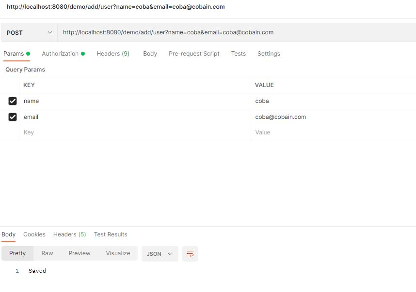
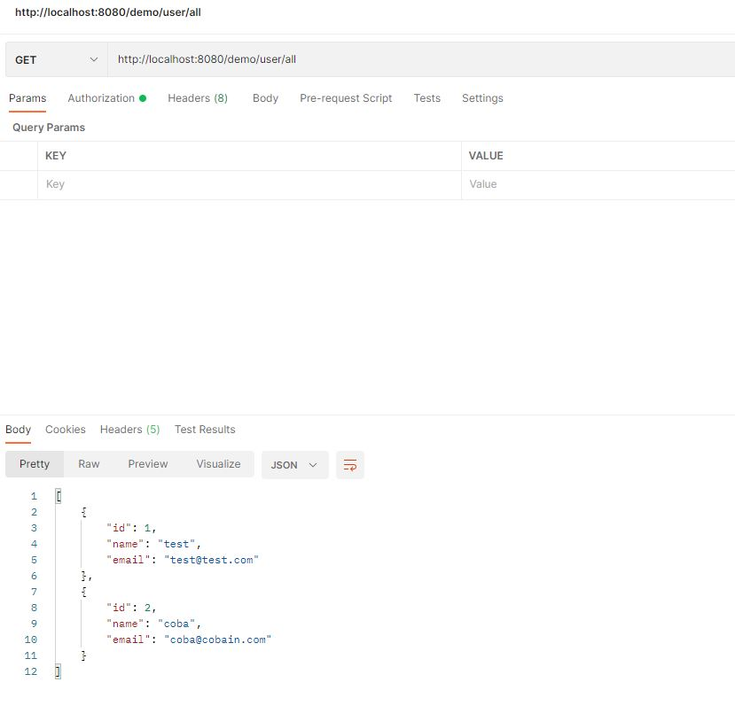

# demospringboot

versi with JPA dengan join
untuk versi GW pindah ke branch, 
sesuaikan setting mysql server di properties.file

Testing spring boot dengan JPA & MySQL dengan API 

- POST /demo/user/add$name='something'$email='s@something'
- GET /demo/user/all

